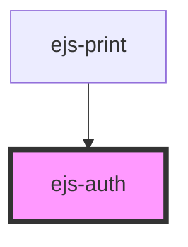

# ejs-auth

<!-- Auto Generated Below -->

## Properties

| Property      | Attribute        | Description | Type     | Default     |
| ------------- | ---------------- | ----------- | -------- | ----------- |
| `clientID`    | `client-i-d`     |             | `string` | `undefined` |
| `redirectURI` | `redirect-u-r-i` |             | `string` | `undefined` |

## Dependencies

### Used by

- [ejs-print](../ejs-print)

### Graph

---
