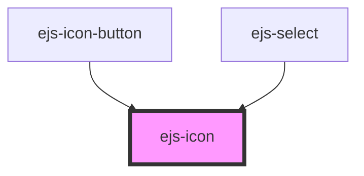

# ezp-icon

<!-- Auto Generated Below -->

## Properties

| Property            | Attribute | Description    | Type                                             | Default     |
| ------------------- | --------- | -------------- | ------------------------------------------------ | ----------- |
| `name` _(required)_ | `name`    | Description... | `"checkmark" \| "expand" \| "menu" \| "printer"` | `undefined` |

## CSS Custom Properties

| Name          | Description    |
| ------------- | -------------- |
| `--host-size` | Description... |

## Dependencies

### Used by

- [ejs-icon-button](../ejs-icon-button)
- [ejs-select](../ejs-select)

### Graph

----------------------------------------------

