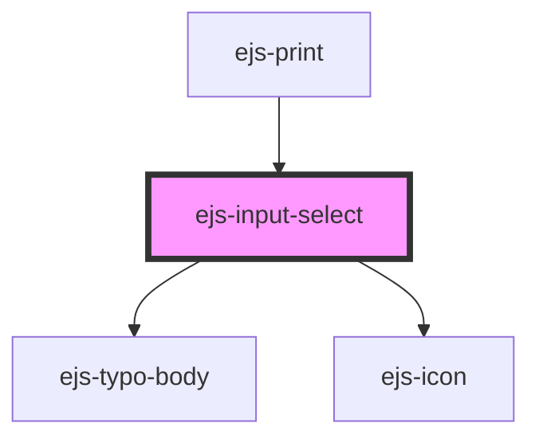

# ejs-input-select

<!-- Auto Generated Below -->

## Properties

| Property      | Attribute     | Description    | Type                 | Default         |
| ------------- | ------------- | -------------- | -------------------- | --------------- |
| `label`       | `label`       | Description... | `string`             | `'Label'`       |
| `options`     | --            | Description... | `SelectOptionType[]` | `undefined`     |
| `placeholder` | `placeholder` | Description... | `string`             | `'Placeholder'` |

## CSS Custom Properties

| Name                     | Description    |
| ------------------------ | -------------- |
| `--details-shadow`       | Description... |
| `--details-template`     | Description... |
| `--host-shadow`          | Description... |
| `--indicator-duration`   | Description... |
| `--indicator-opacity`    | Description... |
| `--indicator-transform`  | Description... |
| `--indicator-transition` | Description... |
| `--indicator-visibility` | Description... |
| `--list-shadow`          | Description... |
| `--option-background`    | Description... |

## Dependencies

### Used by

- [ejs-print](../ejs-print)

### Depends on

- [ejs-typo-body](../ejs-typo-body)
- [ejs-icon](../ejs-icon)

### Graph

---
