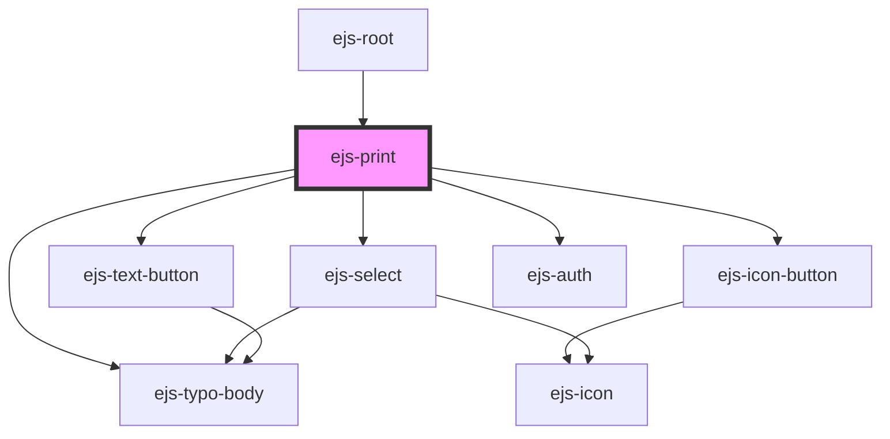

# ejs-print

<!-- Auto Generated Below -->

## Properties

| Property      | Attribute        | Description    | Type     | Default     |
| ------------- | ---------------- | -------------- | -------- | ----------- |
| `clientID`    | `client-i-d`     | Description... | `string` | `undefined` |
| `redirectURI` | `redirect-u-r-i` | Description... | `string` | `undefined` |

## Events

| Event         | Description    | Type                      |
| ------------- | -------------- | ------------------------- |
| `printCancel` | Description... | `CustomEvent<MouseEvent>` |
| `printSubmit` | Description... | `CustomEvent<MouseEvent>` |

## CSS Custom Properties

| Name                          | Description    |
| ----------------------------- | -------------- |
| `--backdrop-opacity`          | Description... |
| `--backdrop-radius`           | Description... |
| `--backdrop-transition`       | Description... |
| `--backdrop-visibility`       | Description... |
| `--content-separator`         | Description... |
| `--dialog-border`             | Description... |
| `--dialog-radius`             | Description... |
| `--dialog-separator-position` | Description... |
| `--duration`                  | Description... |
| `--footer-separator-position` | Description... |
| `--header-separator-position` | Description... |

## Dependencies

### Used by

- [ejs-root](../ejs-root)

### Depends on

- [ejs-typo-body](../ejs-typo-body)
- [ejs-icon-button](../ejs-icon-button)
- [ejs-select](../ejs-select)
- [ejs-text-button](../ejs-text-button)
- [ejs-auth](../ejs-auth)

### Graph

---
