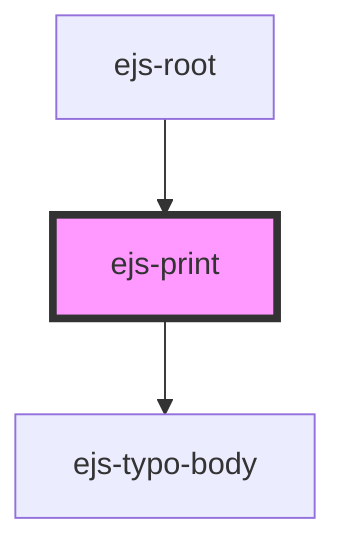

# ejs-print

<!-- Auto Generated Below -->

## Properties

| Property       | Attribute       | Description | Type      | Default |
| -------------- | --------------- | ----------- | --------- | ------- |
| `withBackdrop` | `with-backdrop` |             | `boolean` | `true`  |

## Events

| Event         | Description    | Type               |
| ------------- | -------------- | ------------------ |
| `printCancel` | Description... | `CustomEvent<any>` |
| `printSubmit` | Description... | `CustomEvent<any>` |

## Dependencies

### Used by

- [ejs-root](../ejs-root)

### Depends on

- [ejs-typo-body](../ejs-typo-body)

### Graph

---
