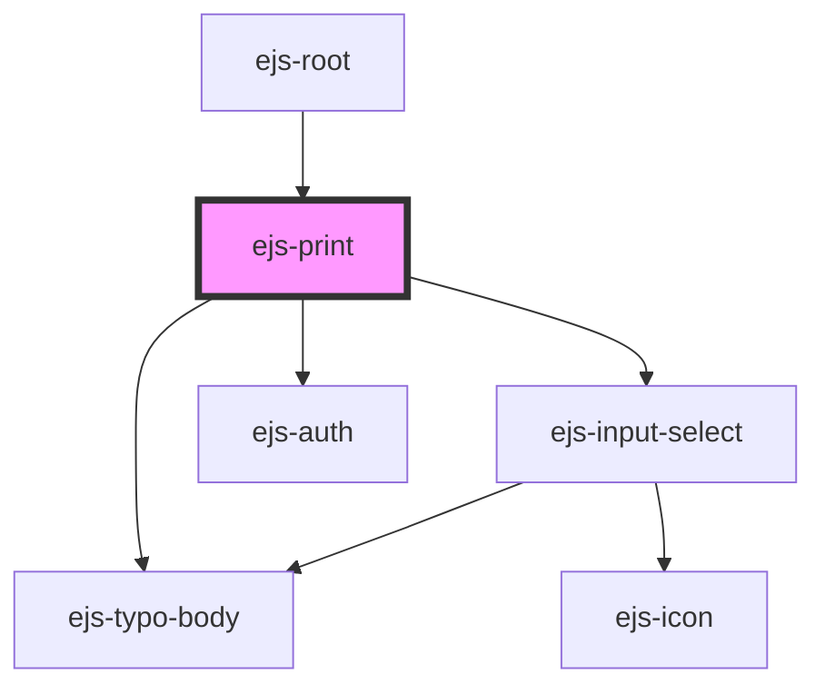

# ejs-print

<!-- Auto Generated Below -->

## Properties

| Property       | Attribute        | Description    | Type      | Default     |
| -------------- | ---------------- | -------------- | --------- | ----------- |
| `clientID`     | `client-i-d`     |                | `string`  | `undefined` |
| `redirectURI`  | `redirect-u-r-i` |                | `string`  | `undefined` |
| `withBackdrop` | `with-backdrop`  | Description... | `boolean` | `true`      |

## Events

| Event         | Description    | Type                      |
| ------------- | -------------- | ------------------------- |
| `printCancel` | Description... | `CustomEvent<MouseEvent>` |
| `printSubmit` | Description... | `CustomEvent<MouseEvent>` |

## Dependencies

### Used by

 - [ejs-root](../ejs-root)

### Depends on

- [ejs-typo-body](../ejs-typo-body)
- [ejs-input-select](../ejs-input-select)
- [ejs-auth](../ejs-auth)

### Graph

----------------------------------------------

