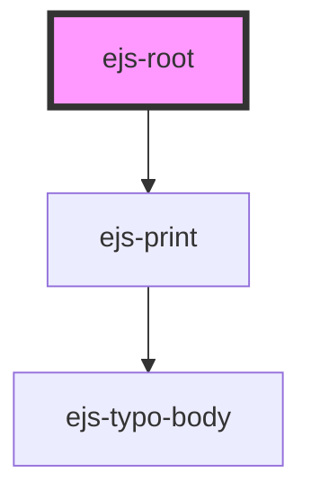

# ejs-root

<!-- Auto Generated Below -->

## Methods

### `closePrint() => Promise<void>`

Description...

#### Returns

Type: `Promise<void>`

### `openPrint() => Promise<void>`

Description...

#### Returns

Type: `Promise<void>`

## Dependencies

### Depends on

- [ejs-print](../ejs-print)

### Graph

---
