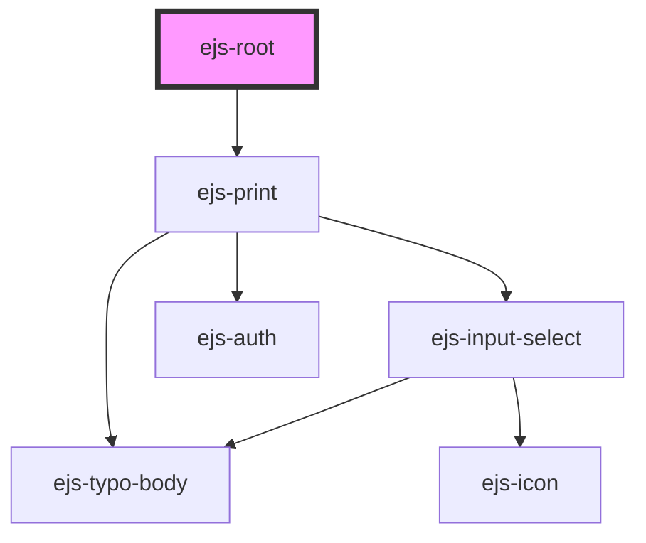

# ejs-root

<!-- Auto Generated Below -->

## Properties

| Property      | Attribute     | Description | Type     | Default     |
| ------------- | ------------- | ----------- | -------- | ----------- |
| `clientid`    | `clientid`    |             | `string` | `undefined` |
| `redirecturi` | `redirecturi` |             | `string` | `undefined` |

## Methods

### `closePrint() => Promise<void>`

Description...

#### Returns

Type: `Promise<void>`

### `openPrint() => Promise<void>`

Description...

#### Returns

Type: `Promise<void>`

## Dependencies

### Depends on

- [ejs-print](../ejs-print)

### Graph

----------------------------------------------

