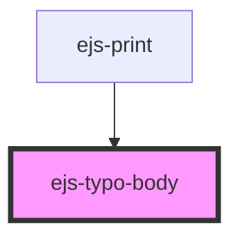

# ejs-typo-body

<!-- Auto Generated Below -->

## Properties

| Property | Attribute | Description    | Type                                     | Default     |
| -------- | --------- | -------------- | ---------------------------------------- | ----------- |
| `level`  | `level`   | Description... | `"primary" \| "secondary" \| "tertiary"` | `'primary'` |
| `weight` | `weight`  | Description... | `"heavy" \| "soft" \| "strong"`          | `'soft'`    |

## CSS Custom Properties

| Name             | Description    |
| ---------------- | -------------- |
| `--body-height`  | Description... |
| `--body-offset`  | Description... |
| `--body-size`    | Description... |
| `--body-spacing` | Description... |
| `--body-weight`  | Description... |

## Dependencies

### Used by

- [ejs-print](../ejs-print)

### Graph

---
