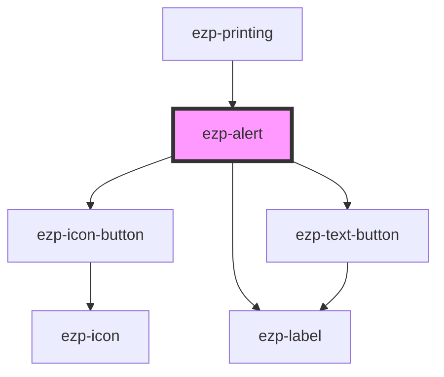

# ezp-alert

<!-- Auto Generated Below -->

## Properties

| Property      | Attribute     | Description | Type     | Default     |
| ------------- | ------------- | ----------- | -------- | ----------- |
| `description` | `description` |             | `string` | `undefined` |
| `heading`     | `heading`     | Properties  | `string` | `undefined` |

## Events

| Event        | Description | Type               |
| ------------ | ----------- | ------------------ |
| `alertClose` | Events      | `CustomEvent<any>` |

## Dependencies

### Used by

- [ezp-printing](../ezp-printing)

### Depends on

- [ezp-icon-button](../ezp-icon-button)
- [ezp-label](../ezp-label)
- [ezp-text-button](../ezp-text-button)

### Graph

---
