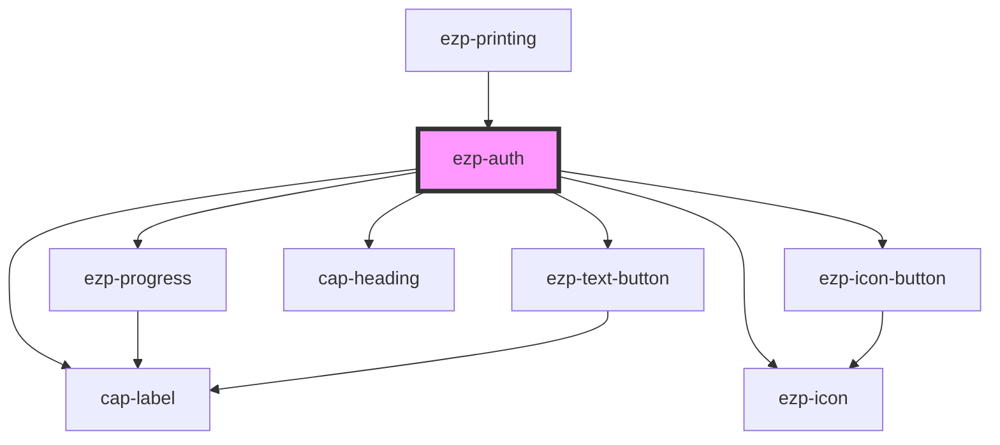

# ezp-auth

<!-- Auto Generated Below -->

## Properties

| Property      | Attribute        | Description | Type      | Default     |
| ------------- | ---------------- | ----------- | --------- | ----------- |
| `clientID`    | `client-i-d`     |             | `string`  | `undefined` |
| `hidelogin`   | `hidelogin`      |             | `boolean` | `undefined` |
| `redirectURI` | `redirect-u-r-i` |             | `string`  | `undefined` |

## Events

| Event        | Description | Type                      |
| ------------ | ----------- | ------------------------- |
| `authCancel` |             | `CustomEvent<MouseEvent>` |
| `printShow`  |             | `CustomEvent<any>`        |

## CSS Custom Properties

| Name                          | Description    |
| ----------------------------- | -------------- |
| `--dialog-radius`             | Description... |
| `--dialog-separator-position` | Description... |

## Dependencies

### Used by

- [ezp-printing](../ezp-printing)

### Depends on

- [ezp-progress](../ezp-progress)
- [ezp-icon-button](../ezp-icon-button)
- [ezp-icon](../ezp-icon)
- cap-heading
- cap-label
- [ezp-text-button](../ezp-text-button)

### Graph

---
