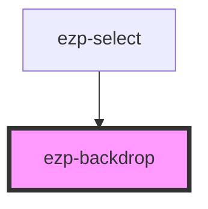

# ezp-backdrop

<!-- Auto Generated Below -->

## Properties

| Property | Attribute | Description | Type      | Default |
| -------- | --------- | ----------- | --------- | ------- |
| `hide`   | `hide`    | Properties  | `boolean` | `false` |

## Dependencies

### Used by

- [ezp-select](../ezp-select)

### Graph

---
