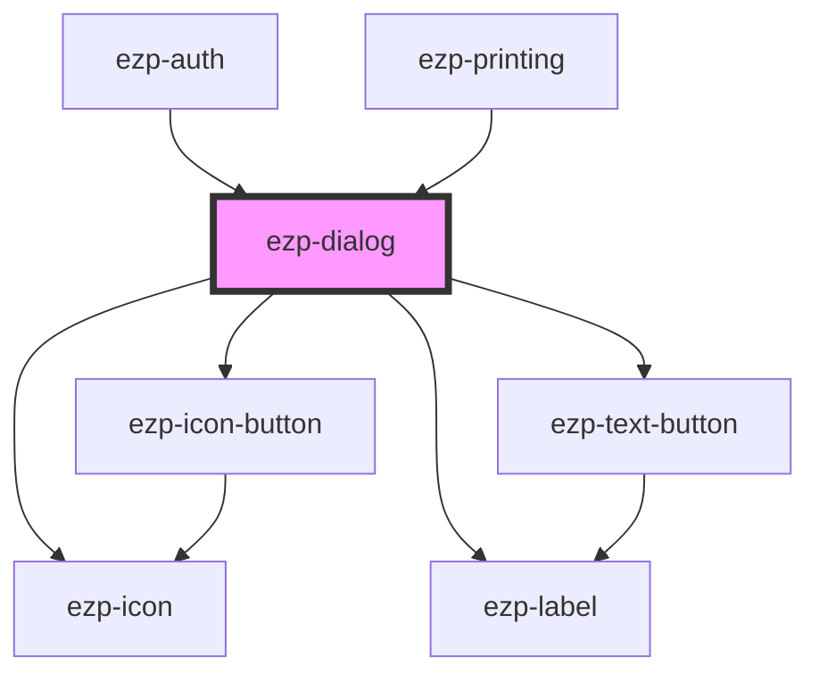

# ezp-dialog

<!-- Auto Generated Below -->

## Properties

| Property      | Attribute     | Description | Type                                                                                                                                                                                                                                                                                                                                                                                                             | Default                             |
| ------------- | ------------- | ----------- | ---------------------------------------------------------------------------------------------------------------------------------------------------------------------------------------------------------------------------------------------------------------------------------------------------------------------------------------------------------------------------------------------------------------- | ----------------------------------- |
| `action`      | `action`      |             | `string`                                                                                                                                                                                                                                                                                                                                                                                                         | `i18next.t('button_actions.close')` |
| `description` | `description` |             | `string`                                                                                                                                                                                                                                                                                                                                                                                                         | `undefined`                         |
| `heading`     | `heading`     |  Properties | `string`                                                                                                                                                                                                                                                                                                                                                                                                         | `undefined`                         |
| `iconFramed`  | `icon-framed` |             | `boolean`                                                                                                                                                                                                                                                                                                                                                                                                        | `true`                              |
| `iconName`    | `icon-name`   |             | `"account" \| "checkmark" \| "checkmark-alt" \| "close" \| "cloud-upload" \| "color" \| "copies" \| "dark" \| "drag-drop" \| "duplex" \| "exclamation-mark" \| "expand" \| "file" \| "height" \| "help" \| "light" \| "logo" \| "logout" \| "menu" \| "minus" \| "orientation" \| "paper_range" \| "plus" \| "printer" \| "quality" \| "question-mark" \| "size" \| "system" \| "trays" \| "width" \| undefined` | `undefined`                         |
| `iconSize`    | `icon-size`   |             | `"huge" \| "large" \| "normal"`                                                                                                                                                                                                                                                                                                                                                                                  | `'large'`                           |
| `instance`    | `instance`    |             | `string`                                                                                                                                                                                                                                                                                                                                                                                                         | `undefined`                         |

## Events

| Event          | Description | Type                  |
| -------------- | ----------- | --------------------- |
| `dialogAction` |             | `CustomEvent<string>` |
| `dialogClose`  |  Events     | `CustomEvent<string>` |

## Dependencies

### Used by

 - [ezp-auth](../ezp-auth)
 - [ezp-printing](../ezp-printing)

### Depends on

- [ezp-icon-button](../ezp-icon-button)
- [ezp-icon](../ezp-icon)
- [ezp-label](../ezp-label)
- [ezp-text-button](../ezp-text-button)

### Graph

```mermaid
graph TD;
  ezp-dialog --> ezp-icon-button
  ezp-dialog --> ezp-icon
  ezp-dialog --> ezp-label
  ezp-dialog --> ezp-text-button
  ezp-icon-button --> ezp-icon
  ezp-text-button --> ezp-label
  ezp-auth --> ezp-dialog
  ezp-printing --> ezp-dialog
  style ezp-dialog fill:#f9f,stroke:#333,stroke-width:4px
```

----------------------------------------------

