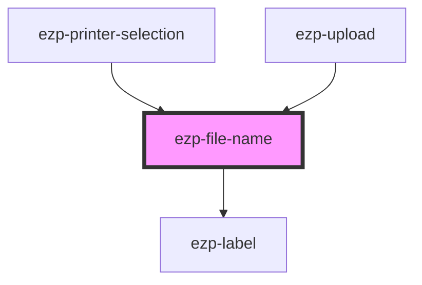

# ezp-file-name

<!-- Auto Generated Below -->

## Properties

| Property    | Attribute   | Description                                                                                                                                     | Type                                     | Default       |
| ----------- | ----------- | ----------------------------------------------------------------------------------------------------------------------------------------------- | ---------------------------------------- | ------------- |
| `level`     | `level`     | Type scale of the rendered name, passed through to `ezp-label`.                                                                                 | `"primary" \| "secondary" \| "tertiary"` | `'secondary'` |
| `name`      | `name`      | The full file name. Always present in the DOM, so screen readers and copy-paste get it in full however it is truncated on screen.               | `string`                                 | `''`          |
| `placement` | `placement` | Side the tooltip opens on. Consumers point it away from the edge their row sits against — `bottom` for the first row of a list, `top` below it. | `"bottom" \| "top"`                      | `'top'`       |
| `weight`    | `weight`    | Font weight of the rendered name, passed through to `ezp-label`.                                                                                | `"heavy" \| "soft" \| "strong"`          | `'soft'`      |

## Dependencies

### Used by

 - [ezp-printer-selection](../ezp-printer-selection)
 - [ezp-upload](../ezp-upload)

### Depends on

- [ezp-label](../ezp-label)

### Graph

----------------------------------------------

