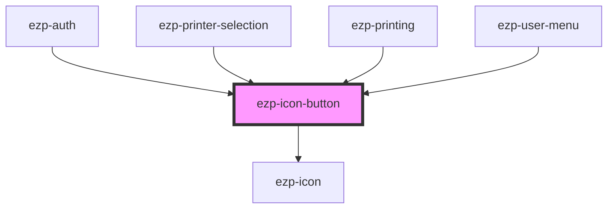

# ezp-icon-button

<!-- Auto Generated Below -->

## Properties

| Property            | Attribute  | Description    | Type                                                                                                     | Default     |
| ------------------- | ---------- | -------------- | -------------------------------------------------------------------------------------------------------- | ----------- |
| `blank`             | `blank`    | Description... | `boolean`                                                                                                | `false`     |
| `disabled`          | `disabled` | Description... | `boolean`                                                                                                | `false`     |
| `href`              | `href`     | Description... | `string`                                                                                                 | `undefined` |
| `icon` _(required)_ | `icon`     | Description... | `"checkmark" \| "cross" \| "expand" \| "menu" \| "off" \| "printer" \| "question" \| "rocket" \| "user"` | `undefined` |
| `level`             | `level`    | Description... | `"primary" \| "quaternary" \| "secondary" \| "tertiary"`                                                 | `'primary'` |
| `type`              | `type`     | Description... | `"button"`                                                                                               | `undefined` |

## CSS Custom Properties

| Name                           | Description    |
| ------------------------------ | -------------- |
| `--button-background`          | Description... |
| `--button-background-active`   | Description... |
| `--button-background-disabled` | Description... |
| `--button-background-hover`    | Description... |
| `--button-background-init`     | Description... |
| `--button-color`               | Description... |
| `--button-color-disabled`      | Description... |
| `--button-color-init`          | Description... |
| `--button-cursor`              | Description... |
| `--button-opacity-active`      | Description... |
| `--button-opacity-hover`       | Description... |
| `--button-opacity-init`        | Description... |

## Dependencies

### Used by

 - [ezp-auth](../ezp-auth)
 - [ezp-printer-selection](../ezp-printer-selection)
 - [ezp-printing](../ezp-printing)
 - [ezp-user-menu](../ezp-user-menu)

### Depends on

- [ezp-icon](../ezp-icon)

### Graph

----------------------------------------------

