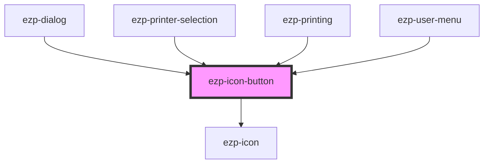

# ezp-icon-button

<!-- Auto Generated Below -->

## Properties

| Property            | Attribute  | Description    | Type                                                                                                                                                                                                                                                                                                                 | Default     |
| ------------------- | ---------- | -------------- | -------------------------------------------------------------------------------------------------------------------------------------------------------------------------------------------------------------------------------------------------------------------------------------------------------------------- | ----------- |
| `blank`             | `blank`    | Description... | `boolean`                                                                                                                                                                                                                                                                                                            | `false`     |
| `disabled`          | `disabled` | Description... | `boolean`                                                                                                                                                                                                                                                                                                            | `false`     |
| `href`              | `href`     | Description... | `string`                                                                                                                                                                                                                                                                                                             | `undefined` |
| `icon` _(required)_ | `icon`     | Description... | `"account" \| "checkmark" \| "close" \| "color" \| "copies" \| "dark" \| "duplex" \| "expand" \| "help" \| "light" \| "logout" \| "menu" \| "minus" \| "orientation" \| "plus" \| "printer" \| "quality" \| "size" \| "system" \| "drag-drop" \| "checkmark-alt" \| "question-mark" \| "exclamation-mark" \| "logo"` | `undefined` |
| `level`             | `level`    | Description... | `"primary" \| "quaternary" \| "secondary" \| "tertiary"`                                                                                                                                                                                                                                                             | `'primary'` |
| `type`              | `type`     | Description... | `"button"`                                                                                                                                                                                                                                                                                                           | `undefined` |

## Dependencies

### Used by

- [ezp-dialog](../ezp-dialog)
- [ezp-printer-selection](../ezp-printer-selection)
- [ezp-printing](../ezp-printing)
- [ezp-user-menu](../ezp-user-menu)

### Depends on

- [ezp-icon](../ezp-icon)

### Graph

---
