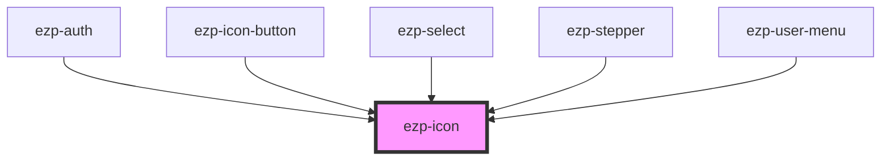

# ezp-icon

<!-- Auto Generated Below -->

## Properties

| Property            | Attribute | Description    | Type                                                                                                                          | Default     |
| ------------------- | --------- | -------------- | ----------------------------------------------------------------------------------------------------------------------------- | ----------- |
| `name` _(required)_ | `name`    | Description... | `"checkmark" \| "cross" \| "expand" \| "menu" \| "minus" \| "off" \| "plus" \| "printer" \| "question" \| "rocket" \| "user"` | `undefined` |
| `size`              | `size`    | Description... | `"large" \| "normal"`                                                                                                         | `'normal'`  |

## Dependencies

### Used by

 - [ezp-auth](../ezp-auth)
 - [ezp-icon-button](../ezp-icon-button)
 - [ezp-select](../ezp-select)
 - [ezp-stepper](../ezp-stepper)
 - [ezp-user-menu](../ezp-user-menu)

### Graph

----------------------------------------------

