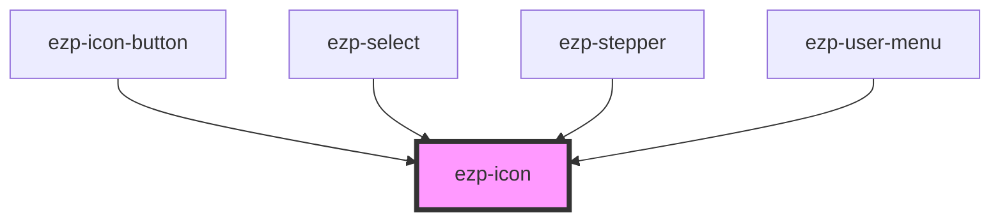

# ezp-icon

<!-- Auto Generated Below -->

## Properties

| Property            | Attribute | Description    | Type                                                                                                                                                                                           | Default     |
| ------------------- | --------- | -------------- | ---------------------------------------------------------------------------------------------------------------------------------------------------------------------------------------------- | ----------- |
| `name` _(required)_ | `name`    | Description... | `"account" \| "checkmark" \| "close" \| "color" \| "copies" \| "duplex" \| "expand" \| "help" \| "logout" \| "menu" \| "minus" \| "orientation" \| "plus" \| "printer" \| "quality" \| "size"` | `undefined` |
| `size`              | `size`    | Description... | `"large" \| "normal"`                                                                                                                                                                          | `'normal'`  |

## Dependencies

### Used by

- [ezp-icon-button](../ezp-icon-button)
- [ezp-select](../ezp-select)
- [ezp-stepper](../ezp-stepper)
- [ezp-user-menu](../ezp-user-menu)

### Graph

---
