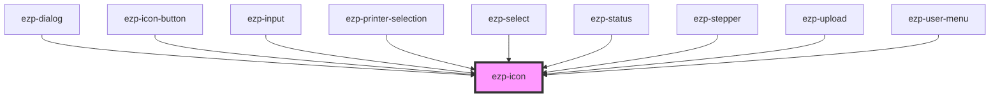

# ezp-icon

<!-- Auto Generated Below -->

## Properties

| Property            | Attribute | Description    | Type                                                                                                                                                                                                                                                                                                                                                                                                | Default     |
| ------------------- | --------- | -------------- | --------------------------------------------------------------------------------------------------------------------------------------------------------------------------------------------------------------------------------------------------------------------------------------------------------------------------------------------------------------------------------------------------- | ----------- |
| `framed`            | `framed`  | Description... | `boolean`                                                                                                                                                                                                                                                                                                                                                                                           | `false`     |
| `name` _(required)_ | `name`    | Description... | `"account" \| "checkmark" \| "checkmark-alt" \| "close" \| "cloud-upload" \| "color" \| "copies" \| "dark" \| "drag-drop" \| "duplex" \| "exclamation-mark" \| "expand" \| "file" \| "height" \| "help" \| "light" \| "logo" \| "logout" \| "menu" \| "minus" \| "orientation" \| "paper_range" \| "plus" \| "printer" \| "quality" \| "question-mark" \| "size" \| "system" \| "trays" \| "width"` | `undefined` |
| `size`              | `size`    | Description... | `"huge" \| "large" \| "normal"`                                                                                                                                                                                                                                                                                                                                                                     | `'normal'`  |

## Dependencies

### Used by

 - [ezp-dialog](../ezp-dialog)
 - [ezp-icon-button](../ezp-icon-button)
 - [ezp-input](../ezp-input)
 - [ezp-printer-selection](../ezp-printer-selection)
 - [ezp-select](../ezp-select)
 - [ezp-status](../ezp-status)
 - [ezp-stepper](../ezp-stepper)
 - [ezp-upload](../ezp-upload)
 - [ezp-user-menu](../ezp-user-menu)

### Graph

```mermaid
graph TD;
  ezp-dialog --> ezp-icon
  ezp-icon-button --> ezp-icon
  ezp-input --> ezp-icon
  ezp-printer-selection --> ezp-icon
  ezp-select --> ezp-icon
  ezp-status --> ezp-icon
  ezp-stepper --> ezp-icon
  ezp-upload --> ezp-icon
  ezp-user-menu --> ezp-icon
  style ezp-icon fill:#f9f,stroke:#333,stroke-width:4px
```

----------------------------------------------

