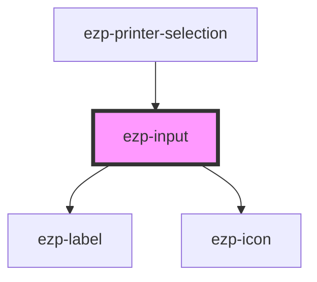

# ezp-input

<!-- Auto Generated Below -->

## Properties

| Property   | Attribute  | Description    | Type                                     | Default       |
| ---------- | ---------- | -------------- | ---------------------------------------- | ------------- |
| `label`    | `label`    | Description... | `string`                                 | `Label`       |
| `value`    | `value`    | Description... | `number | string `                       | `undefined` |
| `type`     | `type`     | Description... | `string`                                 | `'text'`       |
| `icon_name`| `icon_name`| Description... | `"account" \| "checkmark" \| "close" \| "color" \| "copies" \| "dark" \| "duplex" \| "expand" \| "help" \| "light" \| "logout" \| "menu" \| "minus" \| "orientation" \| "plus" \| "printer" \| "quality" \| "size" \| "system" \| "drag-drop" \| "checkmark-alt" \| "question-mark" \| "exclamation-mark" \| "logo"`                                                                               | `undefined'`     |
| `suffix`   | `suffix`   | Description... | `string`          | `undefined`      |

## Dependencies

### Used by

- [ezp-printer-selection](../ezp-printer-selection)

### Graph

---
