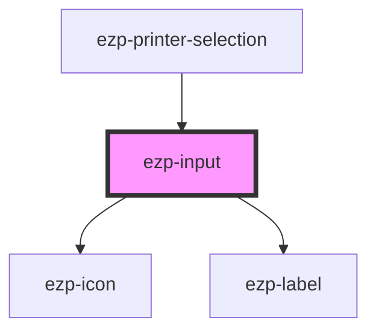

# ezp-input

<!-- Auto Generated Below -->

## Properties

| Property      | Attribute     | Description    | Type                                                                                                                                                                                                                                                                                                                                                                                                | Default     |
| ------------- | ------------- | -------------- | --------------------------------------------------------------------------------------------------------------------------------------------------------------------------------------------------------------------------------------------------------------------------------------------------------------------------------------------------------------------------------------------------- | ----------- |
| `eventType`   | `event-type`  | Description... | `string`                                                                                                                                                                                                                                                                                                                                                                                            | `undefined` |
| `icon`        | `icon`        | Description... | `"account" \| "checkmark" \| "checkmark-alt" \| "close" \| "cloud-upload" \| "color" \| "copies" \| "dark" \| "drag-drop" \| "duplex" \| "exclamation-mark" \| "expand" \| "file" \| "height" \| "help" \| "light" \| "logo" \| "logout" \| "menu" \| "minus" \| "orientation" \| "paper_range" \| "plus" \| "printer" \| "quality" \| "question-mark" \| "size" \| "system" \| "trays" \| "width"` | `'color'`   |
| `label`       | `label`       | Description... | `string`                                                                                                                                                                                                                                                                                                                                                                                            | `'Label'`   |
| `placeholder` | `placeholder` | Description... | `string`                                                                                                                                                                                                                                                                                                                                                                                            | `''`        |
| `suffix`      | `suffix`      | Description... | `string`                                                                                                                                                                                                                                                                                                                                                                                            | `undefined` |
| `type`        | `type`        | Description... | `string`                                                                                                                                                                                                                                                                                                                                                                                            | `'text'`    |
| `value`       | `value`       | Description... | `number \| string`                                                                                                                                                                                                                                                                                                                                                                                  | `undefined` |

## Events

| Event               | Description | Type                                                      |
| ------------------- | ----------- | --------------------------------------------------------- |
| `inputValueChanged` |  Events     | `CustomEvent<{ type: string; value: string \| number; }>` |

## Dependencies

### Used by

 - [ezp-printer-selection](../ezp-printer-selection)

### Depends on

- [ezp-icon](../ezp-icon)
- [ezp-label](../ezp-label)

### Graph

```mermaid
graph TD;
  ezp-input --> ezp-icon
  ezp-input --> ezp-label
  ezp-printer-selection --> ezp-input
  style ezp-input fill:#f9f,stroke:#333,stroke-width:4px
```

----------------------------------------------

