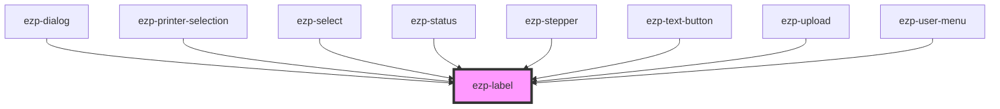

# ezp-label

<!-- Auto Generated Below -->

## Properties

| Property   | Attribute  | Description    | Type                                     | Default       |
| ---------- | ---------- | -------------- | ---------------------------------------- | ------------- |
| `ellipsis` | `ellipsis` | Description... | `boolean`                                | `false`       |
| `level`    | `level`    | Description... | `"primary" \| "secondary" \| "tertiary"` | `'secondary'` |
| `noWrap`   | `no-wrap`  | Description... | `boolean`                                | `false`       |
| `text`     | `text`     | Description... | `string`                                 | `'Label'`     |
| `weight`   | `weight`   | Description... | `"heavy" \| "soft" \| "strong"`          | `'soft'`      |

## Dependencies

### Used by

- [ezp-dialog](../ezp-dialog)
- [ezp-printer-selection](../ezp-printer-selection)
- [ezp-select](../ezp-select)
- [ezp-status](../ezp-status)
- [ezp-stepper](../ezp-stepper)
- [ezp-text-button](../ezp-text-button)
- [ezp-upload](../ezp-upload)
- [ezp-user-menu](../ezp-user-menu)

### Graph

---
