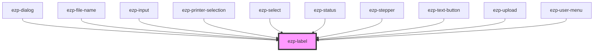

# ezp-label

<!-- Auto Generated Below -->

## Properties

| Property   | Attribute  | Description    | Type                                     | Default       |
| ---------- | ---------- | -------------- | ---------------------------------------- | ------------- |
| `ellipsis` | `ellipsis` | Description... | `boolean`                                | `false`       |
| `level`    | `level`    | Description... | `"primary" \| "secondary" \| "tertiary"` | `'secondary'` |
| `noWrap`   | `no-wrap`  | Description... | `boolean`                                | `false`       |
| `text`     | `text`     | Description... | `string`                                 | `'Label'`     |
| `weight`   | `weight`   | Description... | `"heavy" \| "soft" \| "strong"`          | `'soft'`      |

## Methods

### `isTruncated() => Promise<boolean>`

Whether the text is currently clipped — `ellipsis` only bites when the
text outgrows the space it was given, which callers cannot tell from the
props alone. Lets a caller offer the full text only when it is needed.

#### Returns

Type: `Promise<boolean>`

## Dependencies

### Used by

 - [ezp-dialog](../ezp-dialog)
 - [ezp-file-name](../ezp-file-name)
 - [ezp-input](../ezp-input)
 - [ezp-printer-selection](../ezp-printer-selection)
 - [ezp-select](../ezp-select)
 - [ezp-status](../ezp-status)
 - [ezp-stepper](../ezp-stepper)
 - [ezp-text-button](../ezp-text-button)
 - [ezp-upload](../ezp-upload)
 - [ezp-user-menu](../ezp-user-menu)

### Graph

```mermaid
graph TD;
  ezp-dialog --> ezp-label
  ezp-file-name --> ezp-label
  ezp-input --> ezp-label
  ezp-printer-selection --> ezp-label
  ezp-select --> ezp-label
  ezp-status --> ezp-label
  ezp-stepper --> ezp-label
  ezp-text-button --> ezp-label
  ezp-upload --> ezp-label
  ezp-user-menu --> ezp-label
  style ezp-label fill:#f9f,stroke:#333,stroke-width:4px
```

----------------------------------------------

