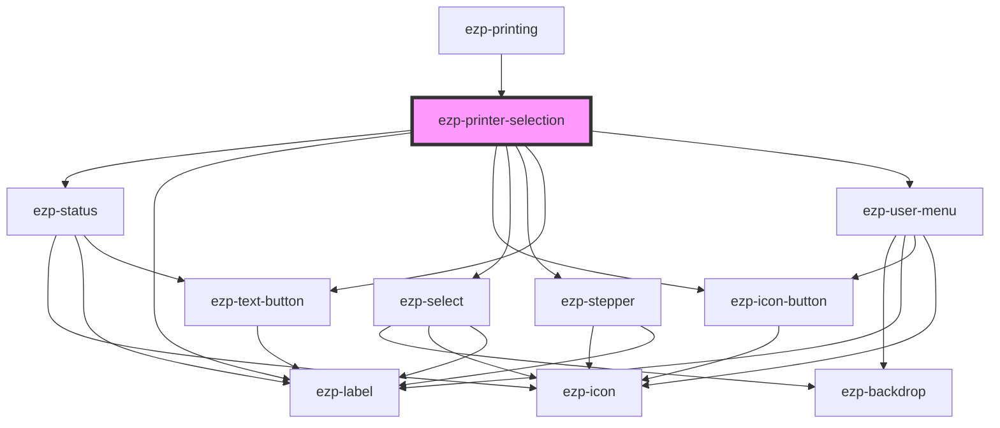

# ezp-print

<!-- Auto Generated Below -->

## Properties

| Property      | Attribute        | Description | Type      | Default     |
| ------------- | ---------------- | ----------- | --------- | ----------- |
| `clientID`    | `client-i-d`     | Properties  | `string`  | `undefined` |
| `file`        | --               |             | `File`    | `undefined` |
| `fileid`      | `fileid`         |             | `string`  | `undefined` |
| `filename`    | `filename`       |             | `string`  | `undefined` |
| `filetype`    | `filetype`       |             | `string`  | `undefined` |
| `fileurl`     | `fileurl`        |             | `string`  | `undefined` |
| `hidelogout`  | `hidelogout`     |             | `boolean` | `undefined` |
| `redirectURI` | `redirect-u-r-i` |             | `string`  | `undefined` |

## Events

| Event         | Description    | Type                      |
| ------------- | -------------- | ------------------------- |
| `printCancel` | Description... | `CustomEvent<MouseEvent>` |
| `printSubmit` | Description... | `CustomEvent<MouseEvent>` |

## Dependencies

### Used by

- [ezp-printing](../ezp-printing)

### Depends on

- [ezp-status](../ezp-status)
- [ezp-label](../ezp-label)
- [ezp-icon-button](../ezp-icon-button)
- [ezp-select](../ezp-select)
- [ezp-stepper](../ezp-stepper)
- [ezp-text-button](../ezp-text-button)
- [ezp-user-menu](../ezp-user-menu)

### Graph

---
