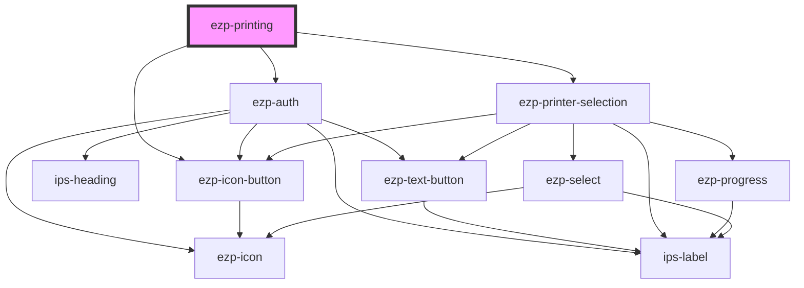

# ezp-root

<!-- Auto Generated Below -->

## Properties

| Property      | Attribute     | Description | Type      | Default     |
| ------------- | ------------- | ----------- | --------- | ----------- |
| `clientid`    | `clientid`    |             | `string`  | `undefined` |
| `custom`      | `custom`      |             | `boolean` | `undefined` |
| `filename`    | `filename`    |             | `string`  | `undefined` |
| `filetype`    | `filetype`    |             | `string`  | `undefined` |
| `fileurl`     | `fileurl`     |             | `string`  | `undefined` |
| `redirecturi` | `redirecturi` |             | `string`  | `undefined` |

## Methods

### `open() => Promise<void>`

Public methods

#### Returns

Type: `Promise<void>`

## Dependencies

### Depends on

- [ezp-auth](../ezp-auth)
- [ezp-printer-selection](../ezp-printer-selection)
- [ezp-icon-button](../ezp-icon-button)

### Graph

---
