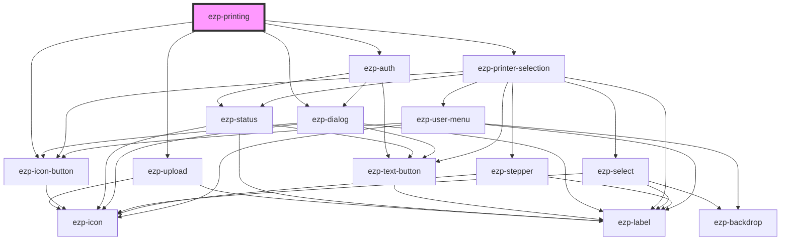

# ezp-root

<!-- Auto Generated Below -->

## Properties

| Property          | Attribute         | Description | Type                                                                               | Default     |
| ----------------- | ----------------- | ----------- | ---------------------------------------------------------------------------------- | ----------- |
| `appearance`      | `appearance`      |             | `"dark" \| "light" \| "system"`                                                    | `'system'`  |
| `authapihosturl`  | `authapihosturl`  |             | `string`                                                                           | `undefined` |
| `clientid`        | `clientid`        |             | `string`                                                                           | `undefined` |
| `custom`          | `custom`          |             | `boolean`                                                                          | `undefined` |
| `file`            | --                |             | `File`                                                                             | `undefined` |
| `fileid`          | `fileid`          |             | `string`                                                                           | `undefined` |
| `filename`        | `filename`        |             | `string`                                                                           | `''`        |
| `filetype`        | `filetype`        |             | `string`                                                                           | `undefined` |
| `fileurl`         | `fileurl`         |             | `string`                                                                           | `undefined` |
| `hidelogin`       | `hidelogin`       |             | `boolean`                                                                          | `undefined` |
| `hidemenu`        | `hidemenu`        |             | `boolean`                                                                          | `false`     |
| `language`        | `language`        |             | `string`                                                                           | `''`        |
| `printapihosturl` | `printapihosturl` |             | `string`                                                                           | `undefined` |
| `redirecturi`     | `redirecturi`     |             | `string`                                                                           | `undefined` |
| `theme`           | `theme`           |             | `"blue" \| "cyan" \| "green" \| "orange" \| "pink" \| "red" \| "teal" \| "violet"` | `'cyan'`    |
| `trigger`         | `trigger`         |             | `"button" \| "custom" \| "file"`                                                   | `undefined` |

## Methods

### `getAuthUri() => Promise<string>`

#### Returns

Type: `Promise<string>`

### `getSasUri() => Promise<string>`

#### Returns

Type: `Promise<string>`

### `logOut() => Promise<void>`

#### Returns

Type: `Promise<void>`

### `open() => Promise<void>`

Public methods

#### Returns

Type: `Promise<void>`

## Dependencies

### Depends on

- [ezp-upload](../ezp-upload)
- [ezp-icon-button](../ezp-icon-button)
- [ezp-auth](../ezp-auth)
- [ezp-printer-selection](../ezp-printer-selection)
- [ezp-dialog](../ezp-dialog)

### Graph

----------------------------------------------

