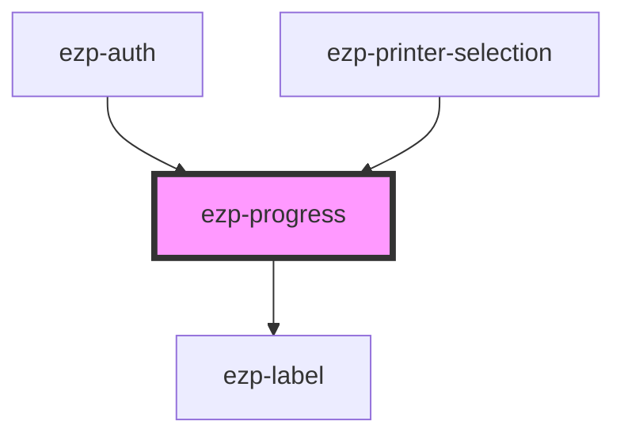

# ezp-progress

<!-- Auto Generated Below -->

## Properties

| Property | Attribute | Description | Type     | Default       |
| -------- | --------- | ----------- | -------- | ------------- |
| `status` | `status`  | Status...   | `string` | `'Status...'` |

## Dependencies

### Used by

- [ezp-auth](../ezp-auth)
- [ezp-printer-selection](../ezp-printer-selection)

### Depends on

- [ezp-label](../ezp-label)

### Graph

---
