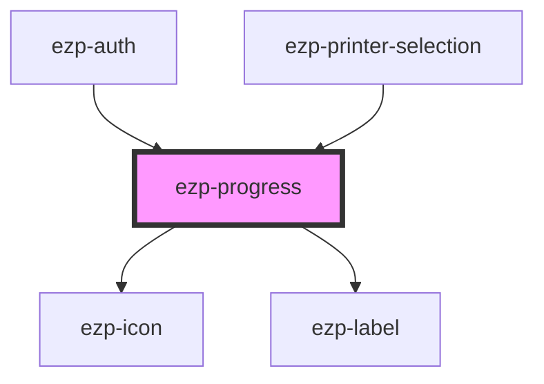

# ezp-progress

<!-- Auto Generated Below -->

## Properties

| Property     | Attribute    | Description | Type                                                                                                                                                                                                                                                                                                       | Default     |
| ------------ | ------------ | ----------- | ---------------------------------------------------------------------------------------------------------------------------------------------------------------------------------------------------------------------------------------------------------------------------------------------------------- | ----------- |
| `icon`       | `icon`       | Status...   | `"account" \| "checkmark" \| "close" \| "color" \| "copies" \| "dark" \| "duplex" \| "expand" \| "help" \| "light" \| "logout" \| "menu" \| "minus" \| "orientation" \| "plus" \| "printer" \| "quality" \| "size" \| "system" \| "drag-drop" \| "checkmark-alt" \| "question-mark" \| "exclamation-mark"` | `undefined` |
| `processing` | `processing` | Status...   | `boolean`                                                                                                                                                                                                                                                                                                  | `false`     |
| `status`     | `status`     | Status...   | `string`                                                                                                                                                                                                                                                                                                   | `'Status'`  |

## Dependencies

### Used by

- [ezp-auth](../ezp-auth)
- [ezp-printer-selection](../ezp-printer-selection)

### Depends on

- [ezp-icon](../ezp-icon)
- [ezp-label](../ezp-label)

### Graph

---
