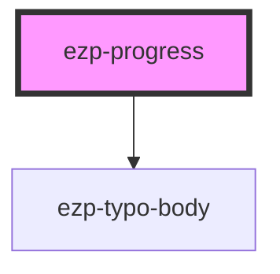

# ezp-progress

<!-- Auto Generated Below -->

## Properties

| Property | Attribute | Description | Type     | Default       |
| -------- | --------- | ----------- | -------- | ------------- |
| `status` | `status`  | Status...   | `string` | `'Status...'` |

## CSS Custom Properties

| Name                       | Description    |
| -------------------------- | -------------- |
| `--box-separator-position` | Description... |
| `--duration`               | Description... |
| `--indicator-size`         | Description... |
| `--stroke-width`           | Description... |

## Dependencies

### Depends on

- [ezp-typo-body](../ezp-typo-body)

### Graph

---
