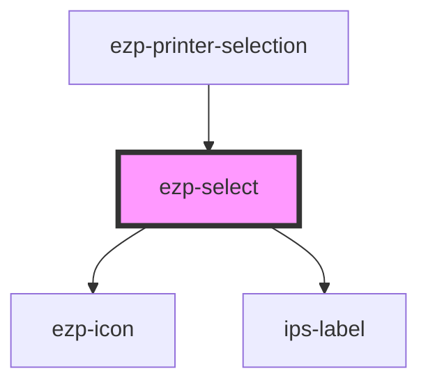

# ezp-select

<!-- Auto Generated Below -->

## Properties

| Property             | Attribute             | Description    | Type                                                                    | Default         |
| -------------------- | --------------------- | -------------- | ----------------------------------------------------------------------- | --------------- |
| `icon`               | `icon`                | Description... | `"checkmark" \| "cross" \| "expand" \| "menu" \| "printer" \| "rocket"` | `undefined`     |
| `label`              | `label`               | Description... | `string`                                                                | `'Label'`       |
| `optionFlow`         | `option-flow`         | Description... | `"horizontal" \| "vertical"`                                            | `'vertical'`    |
| `options`            | --                    | Description... | `SelectOptionType[]`                                                    | `undefined`     |
| `placeholder`        | `placeholder`         | Description... | `string`                                                                | `'Placeholder'` |
| `previouslySelected` | `previously-selected` |                | `any`                                                                   | `undefined`     |
| `toggleFlow`         | `toggle-flow`         | Description... | `"horizontal" \| "vertical"`                                            | `'horizontal'`  |

## Events

| Event             | Description | Type               |
| ----------------- | ----------- | ------------------ |
| `selectSelection` |             | `CustomEvent<any>` |
| `selectToggle`    | Events      | `CustomEvent<any>` |

## CSS Custom Properties

| Name                               | Description    |
| ---------------------------------- | -------------- |
| `--accessory-color`                | Description... |
| `--details-columns`                | Description... |
| `--details-rows`                   | Description... |
| `--duration`                       | Description... |
| `--host-height`                    | Description... |
| `--host-transition`                | Description... |
| `--host-z-index`                   | Description... |
| `--icon-color`                     | Description... |
| `--indicator-opacity`              | Description... |
| `--indicator-transform`            | Description... |
| `--indicator-transition`           | Description... |
| `--indicator-visibility`           | Description... |
| `--label-align`                    | Description... |
| `--label-color`                    | Description... |
| `--list-height`                    | Description... |
| `--list-separator-position`        | Description... |
| `--option-height`                  | Description... |
| `--toggle-areas`                   | Description... |
| `--toggle-columns`                 | Description... |
| `--toggle-height`                  | Description... |
| `--toggle-rows`                    | Description... |
| `--value-align`                    | Description... |
| `--wrap-radius`                    | Description... |
| `--wrap-separator-color`           | Description... |
| `--wrap-separator-position-bottom` | Description... |
| `--wrap-separator-position-left`   | Description... |
| `--wrap-separator-position-right`  | Description... |
| `--wrap-separator-position-top`    | Description... |
| `--wrap-translate-y`               | Description... |

## Dependencies

### Used by

 - [ezp-printer-selection](../ezp-printer-selection)

### Depends on

- [ezp-icon](../ezp-icon)
- ips-label

### Graph

----------------------------------------------

