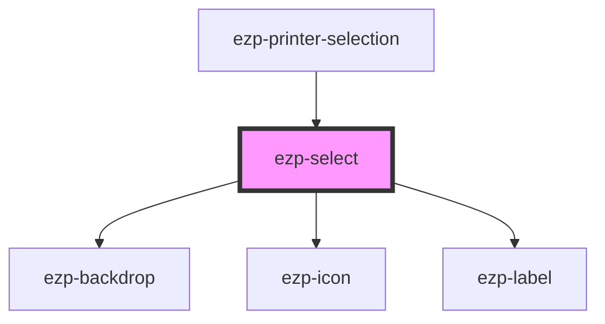

# ezp-select

<!-- Auto Generated Below -->

## Properties

| Property      | Attribute      | Description    | Type                                                                                                                                                                                                                            | Default         |
| ------------- | -------------- | -------------- | ------------------------------------------------------------------------------------------------------------------------------------------------------------------------------------------------------------------------------- | --------------- |
| `icon`        | `icon`         | Description... | `"account" \| "checkmark" \| "close" \| "color" \| "copies" \| "dark" \| "duplex" \| "expand" \| "help" \| "light" \| "logout" \| "menu" \| "minus" \| "orientation" \| "plus" \| "printer" \| "quality" \| "size" \| "system"` | `undefined`     |
| `label`       | `label`        | Description... | `string`                                                                                                                                                                                                                        | `'Label'`       |
| `optionFlow`  | `option-flow`  | Description... | `"horizontal" \| "vertical"`                                                                                                                                                                                                    | `undefined`     |
| `options`     | --             | Description... | `SelectOptionType[]`                                                                                                                                                                                                            | `undefined`     |
| `placeholder` | `placeholder`  | Description... | `string`                                                                                                                                                                                                                        | `'Placeholder'` |
| `preSelected` | `pre-selected` | Description... | `any`                                                                                                                                                                                                                           | `undefined`     |
| `toggleFlow`  | `toggle-flow`  | Description... | `"horizontal" \| "vertical"`                                                                                                                                                                                                    | `'horizontal'`  |

## Events

| Event             | Description | Type               |
| ----------------- | ----------- | ------------------ |
| `selectSelection` |             | `CustomEvent<any>` |
| `selectToggle`    | Events      | `CustomEvent<any>` |

## Dependencies

### Used by

- [ezp-printer-selection](../ezp-printer-selection)

### Depends on

- [ezp-backdrop](../ezp-backdrop)
- [ezp-icon](../ezp-icon)
- [ezp-label](../ezp-label)

### Graph

---
