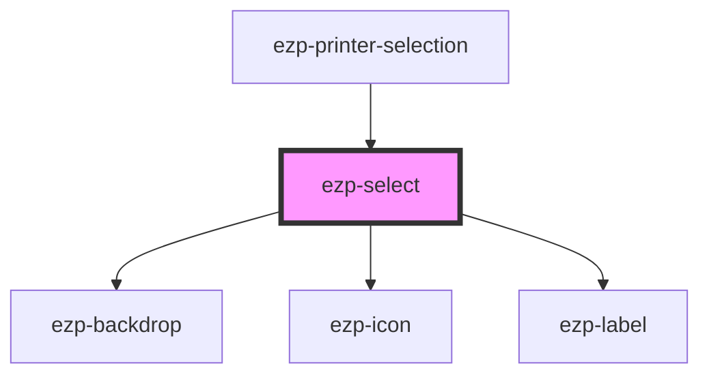

# ezp-select

<!-- Auto Generated Below -->

## Properties

| Property      | Attribute      | Description                                                              | Type                                                                                                                                                                                                                                                                                                                                                                                                | Default         |
| ------------- | -------------- | ------------------------------------------------------------------------ | --------------------------------------------------------------------------------------------------------------------------------------------------------------------------------------------------------------------------------------------------------------------------------------------------------------------------------------------------------------------------------------------------- | --------------- |
| `disabled`    | `disabled`     | Description...                                                           | `boolean`                                                                                                                                                                                                                                                                                                                                                                                           | `false`         |
| `icon`        | `icon`         | Description...                                                           | `"account" \| "checkmark" \| "checkmark-alt" \| "close" \| "cloud-upload" \| "color" \| "copies" \| "dark" \| "drag-drop" \| "duplex" \| "exclamation-mark" \| "expand" \| "file" \| "height" \| "help" \| "light" \| "logo" \| "logout" \| "menu" \| "minus" \| "orientation" \| "paper_range" \| "plus" \| "printer" \| "quality" \| "question-mark" \| "size" \| "system" \| "trays" \| "width"` | `undefined`     |
| `label`       | `label`        | Description...                                                           | `string`                                                                                                                                                                                                                                                                                                                                                                                            | `'Label'`       |
| `optionFlow`  | `option-flow`  | Description...                                                           | `"horizontal" \| "vertical"`                                                                                                                                                                                                                                                                                                                                                                        | `undefined`     |
| `options`     | --             | Description...                                                           | `SelectOptionType[]`                                                                                                                                                                                                                                                                                                                                                                                | `undefined`     |
| `placeholder` | `placeholder`  | Description...                                                           | `string`                                                                                                                                                                                                                                                                                                                                                                                            | `'Placeholder'` |
| `preSelected` | `pre-selected` | The currently-selected option, matched by title (string) or id (number). | `null \| number \| string`                                                                                                                                                                                                                                                                                                                                                                          | `undefined`     |
| `toggleFlow`  | `toggle-flow`  | Description...                                                           | `"horizontal" \| "vertical"`                                                                                                                                                                                                                                                                                                                                                                        | `'horizontal'`  |

## Events

| Event             | Description | Type                                                                                                         |
| ----------------- | ----------- | ------------------------------------------------------------------------------------------------------------ |
| `selectSelection` |             | `CustomEvent<{ id: string \| number \| boolean; title: string; meta: string; type?: string \| undefined; }>` |
| `selectToggle`    |  Events     | `CustomEvent<boolean>`                                                                                       |

## Dependencies

### Used by

 - [ezp-printer-selection](../ezp-printer-selection)

### Depends on

- [ezp-backdrop](../ezp-backdrop)
- [ezp-icon](../ezp-icon)
- [ezp-label](../ezp-label)

### Graph

```mermaid
graph TD;
  ezp-select --> ezp-backdrop
  ezp-select --> ezp-icon
  ezp-select --> ezp-label
  ezp-printer-selection --> ezp-select
  style ezp-select fill:#f9f,stroke:#333,stroke-width:4px
```

----------------------------------------------

