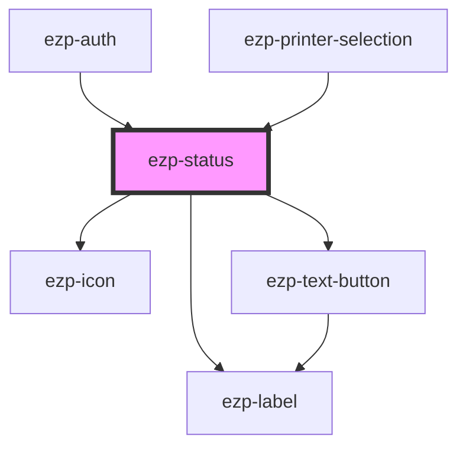

# ezp-status

<!-- Auto Generated Below -->

## Properties

| Property      | Attribute     | Description | Type                                                                                                                                                                                                                                                                                                                                                                                                             | Default         |
| ------------- | ------------- | ----------- | ---------------------------------------------------------------------------------------------------------------------------------------------------------------------------------------------------------------------------------------------------------------------------------------------------------------------------------------------------------------------------------------------------------------- | --------------- |
| `cancel`      | `cancel`      |             | `boolean \| string \| undefined`                                                                                                                                                                                                                                                                                                                                                                                 | `undefined`     |
| `close`       | `close`       |             | `boolean \| string \| undefined`                                                                                                                                                                                                                                                                                                                                                                                 | `undefined`     |
| `description` | `description` |  Properties | `string`                                                                                                                                                                                                                                                                                                                                                                                                         | `'Description'` |
| `icon`        | `icon`        |             | `"account" \| "checkmark" \| "checkmark-alt" \| "close" \| "cloud-upload" \| "color" \| "copies" \| "dark" \| "drag-drop" \| "duplex" \| "exclamation-mark" \| "expand" \| "file" \| "height" \| "help" \| "light" \| "logo" \| "logout" \| "menu" \| "minus" \| "orientation" \| "paper_range" \| "plus" \| "printer" \| "quality" \| "question-mark" \| "size" \| "system" \| "trays" \| "width" \| undefined` | `undefined`     |
| `instance`    | `instance`    |             | `string`                                                                                                                                                                                                                                                                                                                                                                                                         | `undefined`     |
| `processing`  | `processing`  |             | `boolean`                                                                                                                                                                                                                                                                                                                                                                                                        | `false`         |
| `retry`       | `retry`       |             | `boolean \| string \| undefined`                                                                                                                                                                                                                                                                                                                                                                                 | `undefined`     |
| `subtext`     | `subtext`     |             | `string \| undefined`                                                                                                                                                                                                                                                                                                                                                                                            | `undefined`     |

## Events

| Event          | Description | Type                  |
| -------------- | ----------- | --------------------- |
| `statusCancel` |  Events     | `CustomEvent<string>` |
| `statusClose`  |             | `CustomEvent<string>` |
| `statusRetry`  |             | `CustomEvent<string>` |

## Dependencies

### Used by

 - [ezp-auth](../ezp-auth)
 - [ezp-printer-selection](../ezp-printer-selection)

### Depends on

- [ezp-icon](../ezp-icon)
- [ezp-label](../ezp-label)
- [ezp-text-button](../ezp-text-button)

### Graph

```mermaid
graph TD;
  ezp-status --> ezp-icon
  ezp-status --> ezp-label
  ezp-status --> ezp-text-button
  ezp-text-button --> ezp-label
  ezp-auth --> ezp-status
  ezp-printer-selection --> ezp-status
  style ezp-status fill:#f9f,stroke:#333,stroke-width:4px
```

----------------------------------------------

