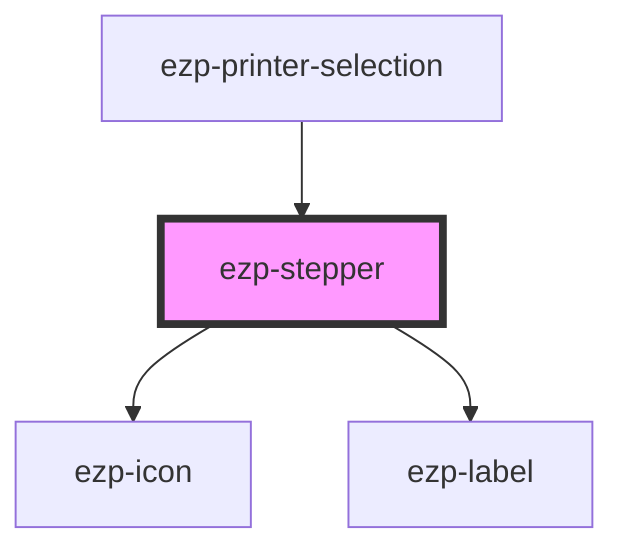

# ezp-stepper

<!-- Auto Generated Below -->

## Properties

| Property | Attribute | Description    | Type                                                                                                                                                                                                                                                                                                       | Default     |
| -------- | --------- | -------------- | ---------------------------------------------------------------------------------------------------------------------------------------------------------------------------------------------------------------------------------------------------------------------------------------------------------- | ----------- |
| `icon`   | `icon`    | Description... | `"account" \| "checkmark" \| "close" \| "color" \| "copies" \| "dark" \| "duplex" \| "expand" \| "help" \| "light" \| "logout" \| "menu" \| "minus" \| "orientation" \| "plus" \| "printer" \| "quality" \| "size" \| "system" \| "drag-drop" \| "checkmark-alt" \| "question-mark" \| "exclamation-mark"` | `undefined` |
| `label`  | `label`   | Description... | `string`                                                                                                                                                                                                                                                                                                   | `'Label'`   |
| `max`    | `max`     | Description... | `number`                                                                                                                                                                                                                                                                                                   | `undefined` |
| `min`    | `min`     | Description... | `number`                                                                                                                                                                                                                                                                                                   | `1`         |

## Events

| Event            | Description | Type               |
| ---------------- | ----------- | ------------------ |
| `stepperChanged` | Events      | `CustomEvent<any>` |

## Dependencies

### Used by

- [ezp-printer-selection](../ezp-printer-selection)

### Depends on

- [ezp-icon](../ezp-icon)
- [ezp-label](../ezp-label)

### Graph

---
