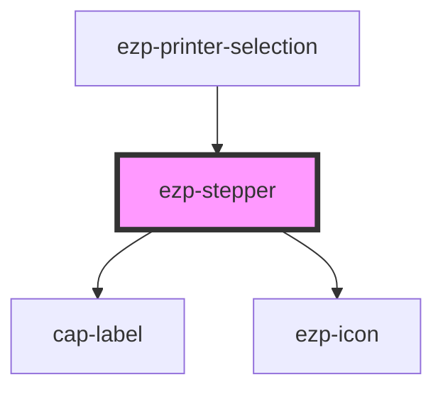

# ezp-stepper

<!-- Auto Generated Below -->

## Properties

| Property | Attribute | Description    | Type     | Default     |
| -------- | --------- | -------------- | -------- | ----------- |
| `label`  | `label`   | Description... | `string` | `'Label'`   |
| `max`    | `max`     | Description... | `number` | `undefined` |
| `min`    | `min`     | Description... | `number` | `1`         |

## Dependencies

### Used by

- [ezp-printer-selection](../ezp-printer-selection)

### Depends on

- cap-label
- [ezp-icon](../ezp-icon)

### Graph

---
