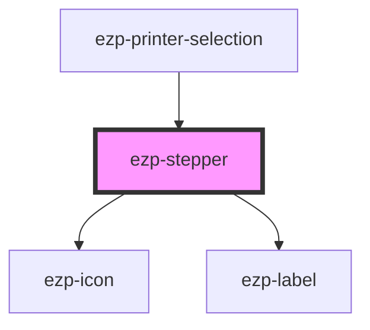

# ezp-stepper

<!-- Auto Generated Below -->

## Properties

| Property | Attribute | Description    | Type                                                                                                                                                                                                                                                                                                                                                                                                | Default     |
| -------- | --------- | -------------- | --------------------------------------------------------------------------------------------------------------------------------------------------------------------------------------------------------------------------------------------------------------------------------------------------------------------------------------------------------------------------------------------------- | ----------- |
| `icon`   | `icon`    | Description... | `"account" \| "checkmark" \| "checkmark-alt" \| "close" \| "cloud-upload" \| "color" \| "copies" \| "dark" \| "drag-drop" \| "duplex" \| "exclamation-mark" \| "expand" \| "file" \| "height" \| "help" \| "light" \| "logo" \| "logout" \| "menu" \| "minus" \| "orientation" \| "paper_range" \| "plus" \| "printer" \| "quality" \| "question-mark" \| "size" \| "system" \| "trays" \| "width"` | `undefined` |
| `label`  | `label`   | Description... | `string`                                                                                                                                                                                                                                                                                                                                                                                            | `'Label'`   |
| `max`    | `max`     | Description... | `number`                                                                                                                                                                                                                                                                                                                                                                                            | `undefined` |
| `min`    | `min`     | Description... | `number`                                                                                                                                                                                                                                                                                                                                                                                            | `1`         |

## Events

| Event            | Description | Type                  |
| ---------------- | ----------- | --------------------- |
| `stepperChanged` |  Events     | `CustomEvent<number>` |

## Dependencies

### Used by

 - [ezp-printer-selection](../ezp-printer-selection)

### Depends on

- [ezp-icon](../ezp-icon)
- [ezp-label](../ezp-label)

### Graph

```mermaid
graph TD;
  ezp-stepper --> ezp-icon
  ezp-stepper --> ezp-label
  ezp-printer-selection --> ezp-stepper
  style ezp-stepper fill:#f9f,stroke:#333,stroke-width:4px
```

----------------------------------------------

