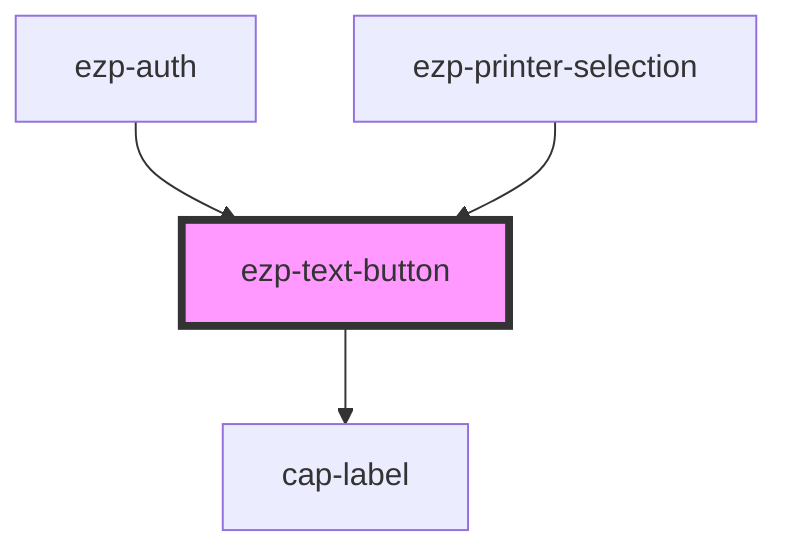

# ezp-text-button

<!-- Auto Generated Below -->

## Properties

| Property   | Attribute  | Description    | Type                                     | Default     |
| ---------- | ---------- | -------------- | ---------------------------------------- | ----------- |
| `blank`    | `blank`    | Description... | `boolean`                                | `false`     |
| `disabled` | `disabled` | Description... | `boolean`                                | `false`     |
| `href`     | `href`     | Description... | `string`                                 | `undefined` |
| `level`    | `level`    | Description... | `"primary" \| "secondary" \| "tertiary"` | `'primary'` |
| `type`     | `type`     | Description... | `"button"`                               | `undefined` |

## Dependencies

### Used by

- [ezp-auth](../ezp-auth)
- [ezp-printer-selection](../ezp-printer-selection)

### Depends on

- cap-label

### Graph

---
