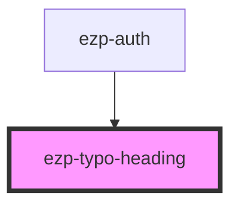

# ezp-typo-heading

<!-- Auto Generated Below -->

## Properties

| Property | Attribute | Description    | Type                                                                              | Default     |
| -------- | --------- | -------------- | --------------------------------------------------------------------------------- | ----------- |
| `level`  | `level`   | Description... | `"primary" \| "quaternary" \| "quinary" \| "secondary" \| "senary" \| "tertiary"` | `'primary'` |
| `tag`    | `tag`     | Description... | `1 \| 2 \| 3 \| 4 \| 5 \| 6`                                                      | `1`         |
| `weight` | `weight`  | Description... | `"heavy" \| "soft" \| "strong"`                                                   | `'heavy'`   |

## CSS Custom Properties

| Name                | Description    |
| ------------------- | -------------- |
| `--heading-height`  | Description... |
| `--heading-offset`  | Description... |
| `--heading-size`    | Description... |
| `--heading-spacing` | Description... |
| `--heading-weight`  | Description... |

## Dependencies

### Used by

- [ezp-auth](../ezp-auth)

### Graph

---
