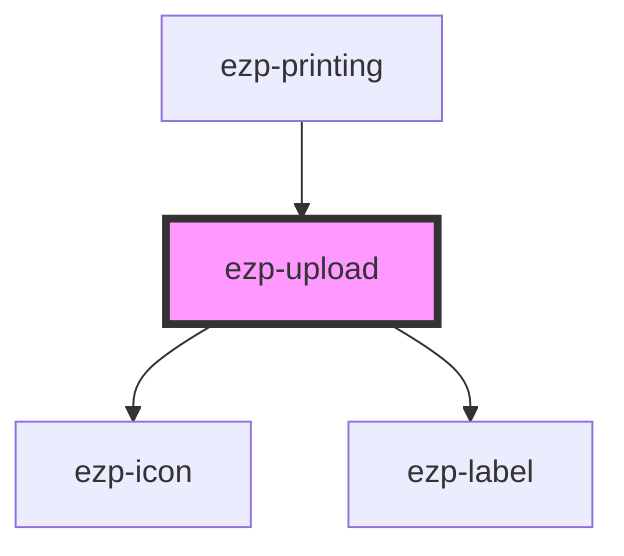

# ezp-upload

<!-- Auto Generated Below -->

## Events

| Event           | Description | Type               |
| --------------- | ----------- | ------------------ |
| `uploadInvalid` |             | `CustomEvent<any>` |
| `uploadValid`   | Events      | `CustomEvent<any>` |

## Dependencies

### Used by

- [ezp-printing](../ezp-printing)

### Depends on

- [ezp-icon](../ezp-icon)
- [ezp-label](../ezp-label)

### Graph

---
