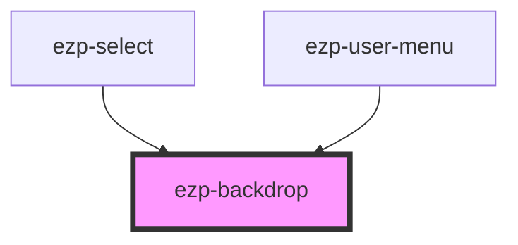

# ezp-upload

<!-- Auto Generated Below -->

## Properties

| Property  | Attribute | Description | Type      | Default |
| --------- | --------- | ----------- | --------- | ------- |
| `visible` | `visible` |             | `boolean` | `true`  |

## Events

| Event               | Description | Type               |
| ------------------- | ----------- | ------------------ |
| `backdropHideEnd`   |             | `CustomEvent<any>` |
| `backdropHideStart` |             | `CustomEvent<any>` |

## Dependencies

### Used by

- [ezp-select](../ezp-select)
- [ezp-user-menu](../ezp-user-menu)

### Graph

---
