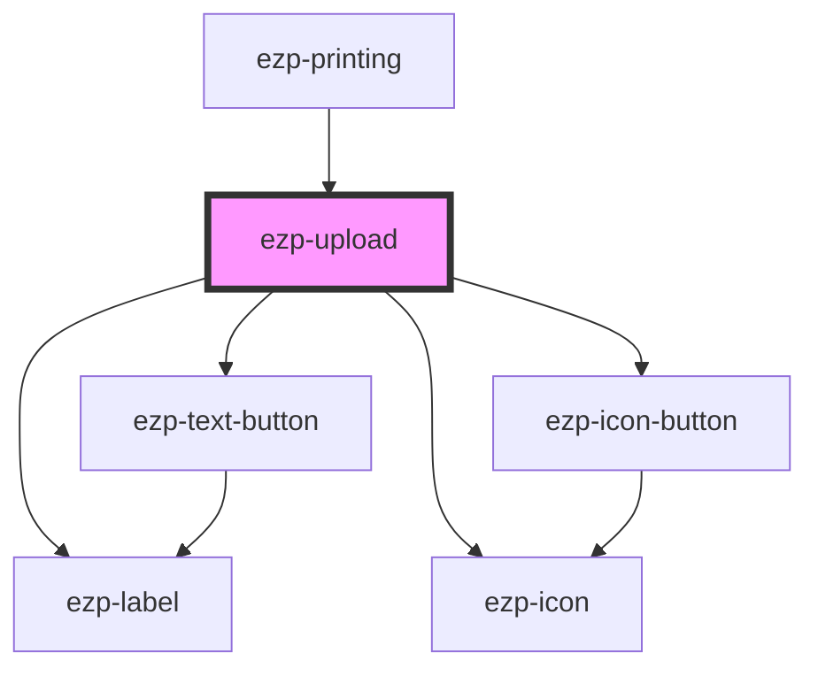

# ezp-upload

<!-- Auto Generated Below -->

## Events

| Event            | Description                                                                       | Type                  |
| ---------------- | --------------------------------------------------------------------------------- | --------------------- |
| `uploadContinue` | Fired when the user confirms the selection and wants to move on to print options. | `CustomEvent<File[]>` |
| `uploadFile`     | Keeps the parent's file state in sync as the selection changes.                   | `CustomEvent<File[]>` |

## Dependencies

### Used by

 - [ezp-printing](../ezp-printing)

### Depends on

- [ezp-label](../ezp-label)
- [ezp-icon-button](../ezp-icon-button)
- [ezp-icon](../ezp-icon)
- [ezp-text-button](../ezp-text-button)

### Graph

```mermaid
graph TD;
  ezp-upload --> ezp-label
  ezp-upload --> ezp-icon-button
  ezp-upload --> ezp-icon
  ezp-upload --> ezp-text-button
  ezp-icon-button --> ezp-icon
  ezp-text-button --> ezp-label
  ezp-printing --> ezp-upload
  style ezp-upload fill:#f9f,stroke:#333,stroke-width:4px
```

----------------------------------------------

