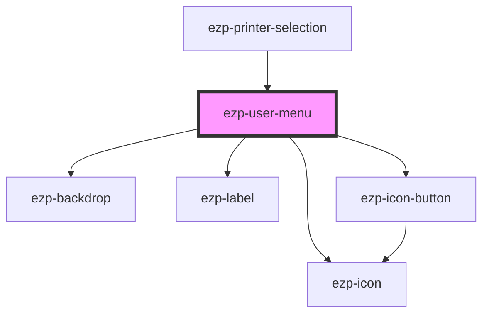

# ezp-user-menu

<!-- Auto Generated Below -->

## Properties

| Property     | Attribute    | Description | Type      | Default      |
| ------------ | ------------ | ----------- | --------- | ------------ |
| `hidelogout` | `hidelogout` |             | `boolean` | `undefined`  |
| `name`       | `name`       |             | `string`  | `'John Doe'` |
| `open`       | `open`       |             | `boolean` | `false`      |

## Events

| Event             | Description | Type               |
| ----------------- | ----------- | ------------------ |
| `logoutEmitter`   |             | `CustomEvent<any>` |
| `userMenuClosure` | Events      | `CustomEvent<any>` |

## Dependencies

### Used by

- [ezp-printer-selection](../ezp-printer-selection)

### Depends on

- [ezp-backdrop](../ezp-backdrop)
- [ezp-label](../ezp-label)
- [ezp-icon-button](../ezp-icon-button)
- [ezp-icon](../ezp-icon)

### Graph

---
