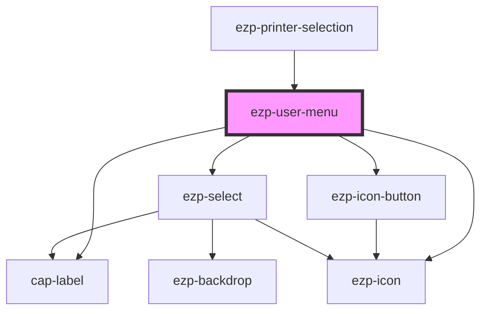

# ezp-user-menu

<!-- Auto Generated Below -->

## Properties

| Property | Attribute | Description | Type      | Default      |
| -------- | --------- | ----------- | --------- | ------------ |
| `name`   | `name`    |             | `string`  | `'John Doe'` |
| `open`   | `open`    |             | `boolean` | `false`      |

## Events

| Event             | Description | Type               |
| ----------------- | ----------- | ------------------ |
| `logoutEmitter`   |             | `CustomEvent<any>` |
| `userMenuClosure` | Events      | `CustomEvent<any>` |

## Dependencies

### Used by

 - [ezp-printer-selection](../ezp-printer-selection)

### Depends on

- cap-label
- [ezp-icon-button](../ezp-icon-button)
- [ezp-select](../ezp-select)
- [ezp-icon](../ezp-icon)

### Graph

----------------------------------------------

